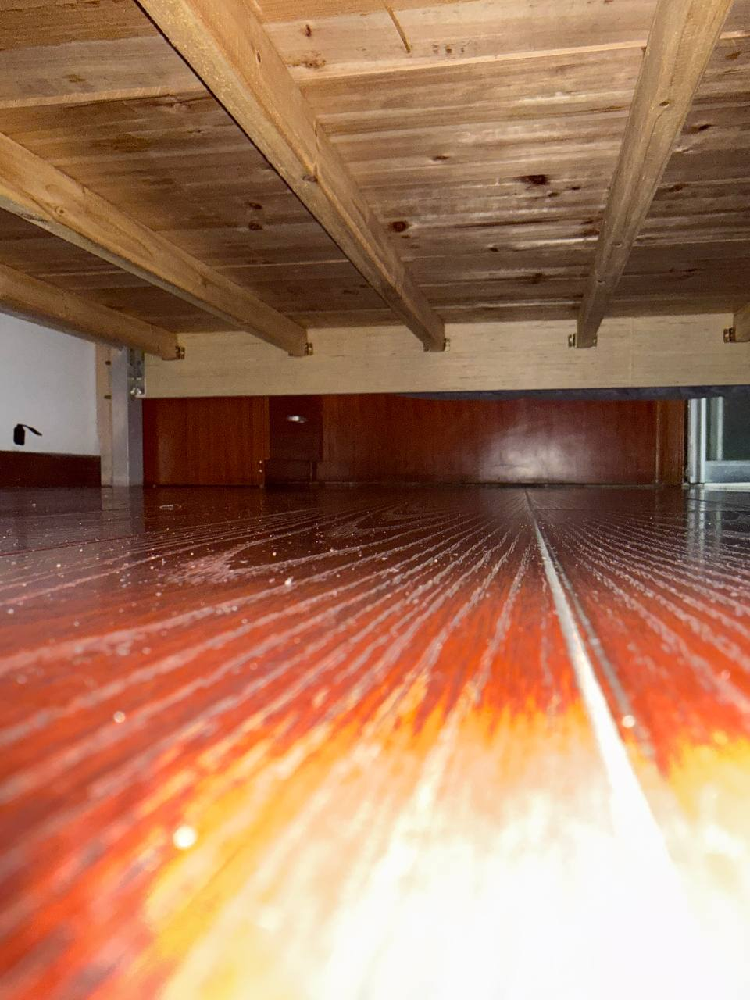
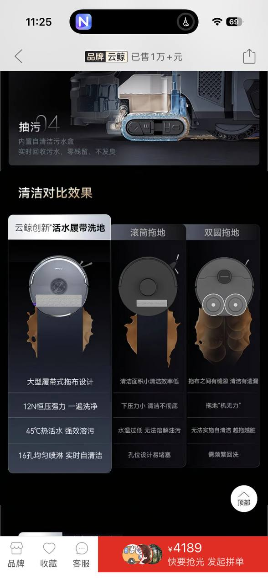
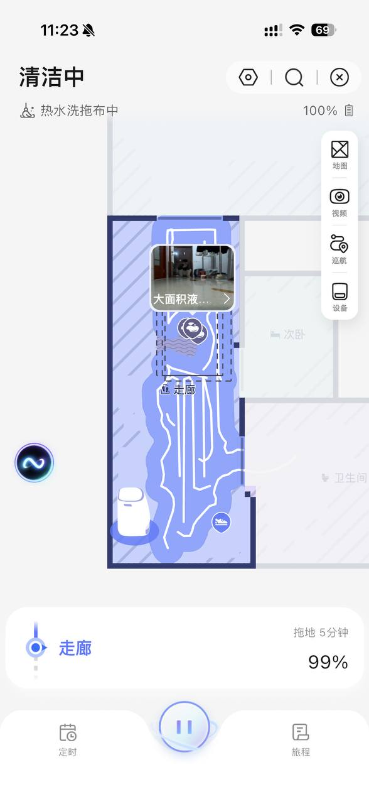
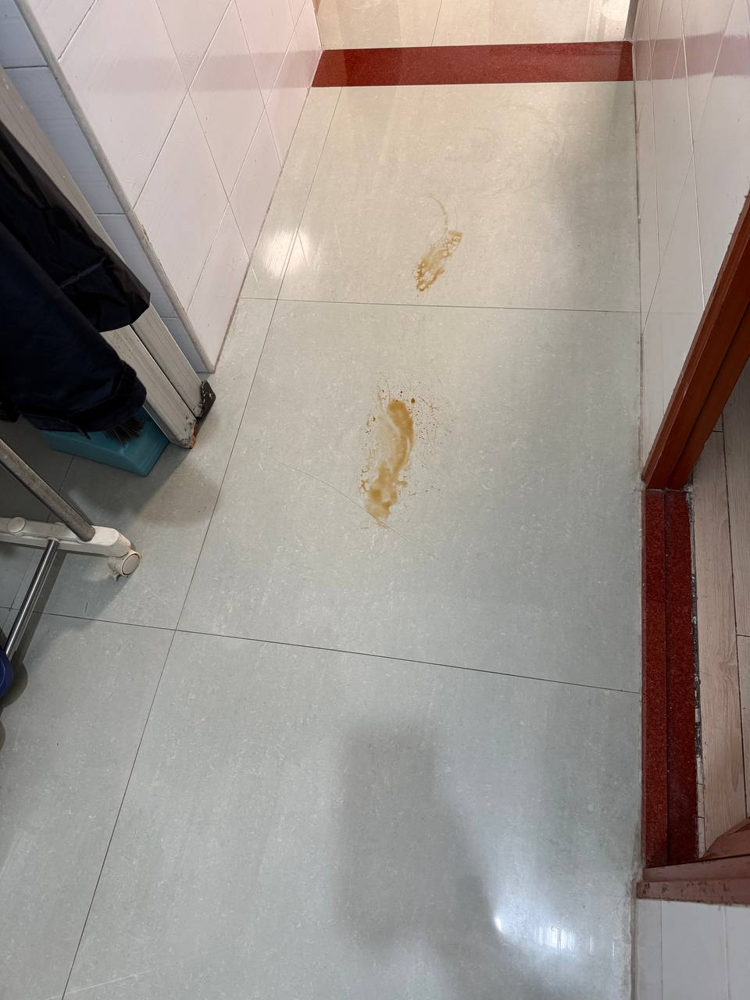
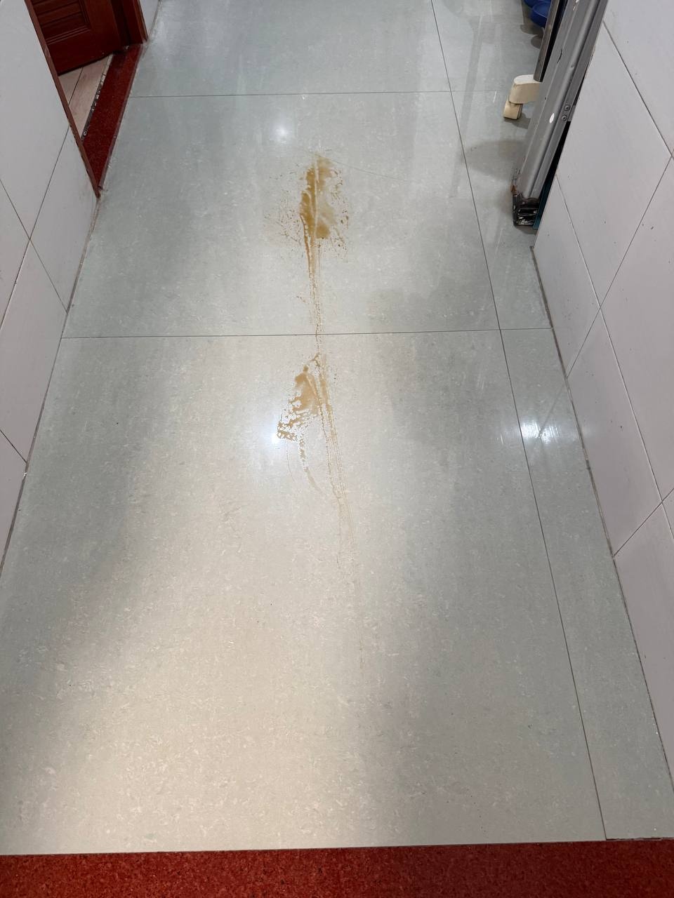
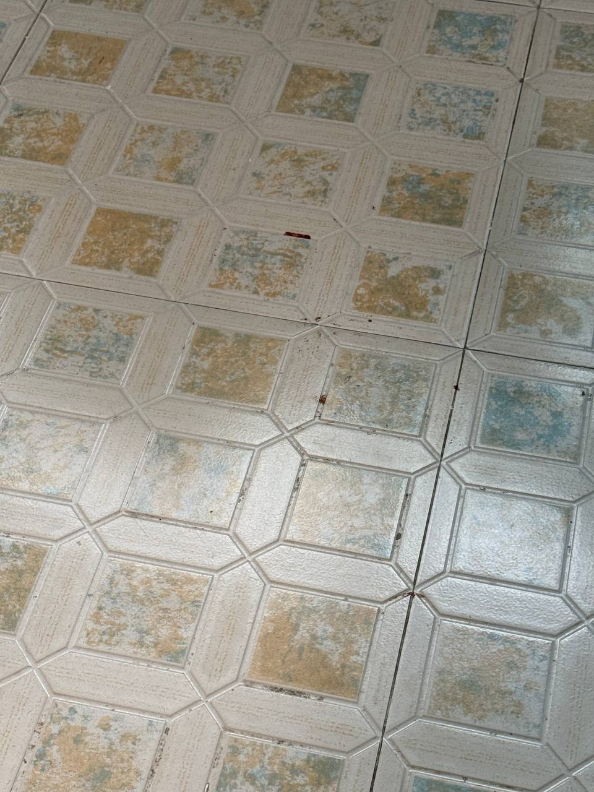

## 前言
中文互联网有一些奇怪的现象，比如买不到真二手的坚果投影仪，在闲鱼上如果搜索坚果投影仪，出来的完全都是卖假货的二手商。还有今天的例子，完全没有任何真人测评的扫地机器人。在全网搜索永远都是满满的广告。看不到任何真人内容。那就让我写这一篇纯骂无广的内容吧。 

其实倒不一定是针对云鲸，因为不排除其它家的扫地机也是一样傻逼。

## 购买前

为什么买云鲸而不是追觅或者石头。是因为xxxxx

然后发现云鲸的配置与产品力不错，然后发现他们价格歧视做的很好。比如jd

## 使用体验

但是真上手之后，我真的是想杀掉它们所有人，这个云鲸我是真的想杀杀杀。

### 吸不干净的床底

云鲸 002 Max 的机身高度确实可以钻进床底，这点要承认。

但问题是：**钻进去了也没用**。

我让它每天自动清扫，一天跑好几次。连续多天之后趴下去一看——床底的灰尘碎屑还是原封不动躺在那里。

能进去和能吸干净是两回事。

### 拖不干净的地

先看官方宣传：

云鲸主打的「活水履带洗地」，号称：
- 12N恒压强力一遍洗净
- 45°C热活水强效溶污
- 16孔均匀喷淋实时自清洁

听起来很厉害对吧？

**现实是：它检测到脏东西就不拖了。**

云鲸有个「大面积液体检测」功能，检测到地上有液体或污渍，就会**绕开不拖**。

所以问题来了：你的活水洗再厉害有什么用？遇到脏东西直接跳过，那这个功能存在的意义是什么？

#### 活水实验

为了验证这一点，我做了个实验。

在地上弄了两坨脏东西：

让云鲸去拖。结果：

**它没有「洗净」任何东西，只是把脏东西抹成了一条线。**

所谓的「活水洗」，实际上是「活水涂」。

#### 阳台仿古砖

阳台铺的是仿古砖，有纹理和砖缝。之前装空调的师傅不小心在地上留了一些血迹（别问）。

我想着正好测试一下云鲸的清洁能力。它确实去拖了，但结果是：**砖缝里的血迹纹丝不动**。

所谓的「12N恒压强力」，遇到稍微有点纹理的地面就无能为力。

#### 平砖客厅

<!-- TODO: 等补图 -->
就算地面是平的瓷砖也拖不干净。客厅地上的靴印，拖完还是清晰可见。